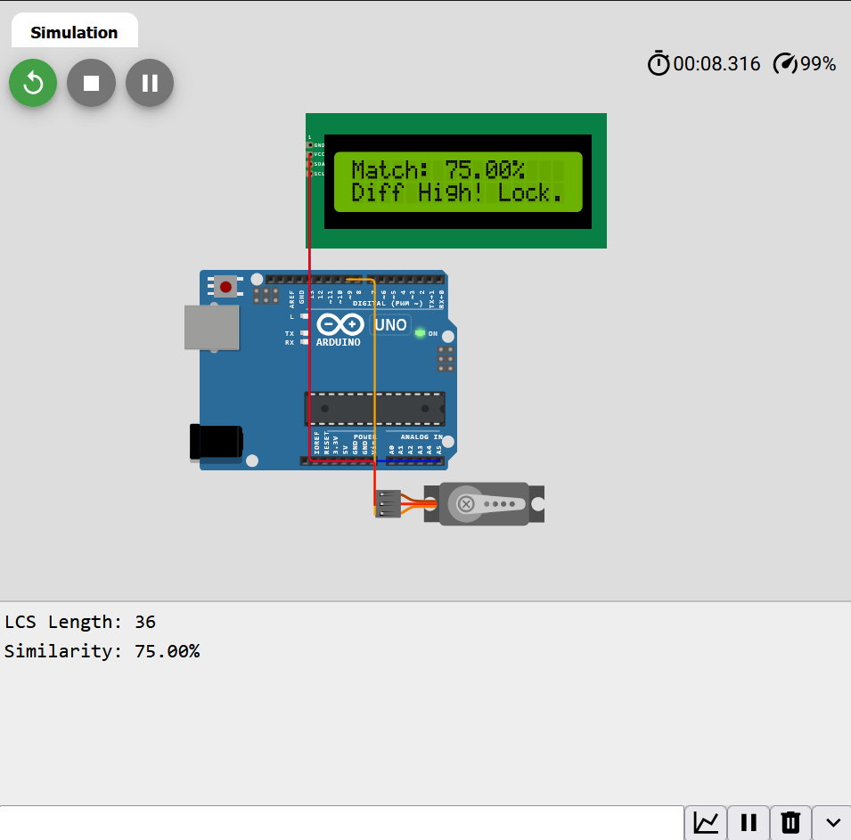

# MicroDiff: Embedded Text Analysis Engine 🚀

## 📖 Overview
MicroDiff is a lightweight, hardware-integrated text analysis engine designed specifically for memory-constrained embedded systems. It performs real-time comparison of text strings (such as system configuration plans) using a highly optimized Longest Common Subsequence (LCS) algorithm. 

Bridging the gap between theoretical computer science and bare-metal mechatronics, this system processes data with extreme memory efficiency and makes physical actuation decisions based on textual similarity percentages.

### 📺 Live Demo & Output
Here is the execution of the optimized engine running inside the Wokwi simulation environment, successfully analyzing file differences and triggering a mechatronic lock response:

## 🧠 Engineering Analysis: Space Optimization
The standard dynamic programming implementation of the LCS algorithm requires a 2D matrix, resulting in a space complexity of `O(m * n)`. On a standard microcontroller with severely limited SRAM (e.g., 2KB), this approach immediately results in a stack overflow for large texts.

**The Solution:**
MicroDiff implements a bitwise space-optimized approach. By recognizing that the calculation only ever requires the current and previous rows of the DP matrix, the algorithm continuously toggles between two rows using bitwise AND (`i & 1`). 
* **Time Complexity:** `O(m * n)`
* **Space Complexity:** `O(min(m, n))`

*Read the full mathematical breakdown in our [Algorithm Notes](docs/algorithm_notes.md).*

## ⚙️ Hardware Architecture
The system architecture relies on minimal GPIO usage by leveraging serial communication protocols.
* **Processing Unit:** Arduino Uno (ATmega328P) showcasing aggressive memory management.
* **Display Output:** 16x2 LCD operating over the **I2C protocol** to display analysis progress and match percentage.
* **Physical Actuator:** PWM-controlled Servo Motor acting as a mechatronic gate/lock that physically reacts if the file variance exceeds a defined safety threshold.

## 📂 Repository Structure
* `src/`: Contains the core C++ logic (`main.ino`) featuring the optimized algorithm.
* `simulation/`: Includes the `diagram.json` mapping for rapid reproduction in Wokwi.
* `data/`: Sample text targets utilized for difference analysis (`plan5_en.txt`, `plan6_en.txt`).
* `docs/`: Project documentation, algorithmic notes, and architecture details.

## 🚀 How to Run (Simulation Environment)
You can deploy and test this system entirely in the cloud without physical hardware:
1. Clone this repository.
2. Open the [Wokwi Simulator](https://wokwi.com) and create a new Arduino project.
3. Replace the default code with the contents of `src/main.ino`.
4. Replace the environment mapping with `simulation/diagram.json`.
5. Add the **LiquidCrystal I2C** library via the Wokwi Library Manager.
6. Run the simulation to observe the text analysis, percentage calculation, and automated servo actuation.

---
*Developed as part of academic coursework and research at **Amirkabir University of Technology**.*
